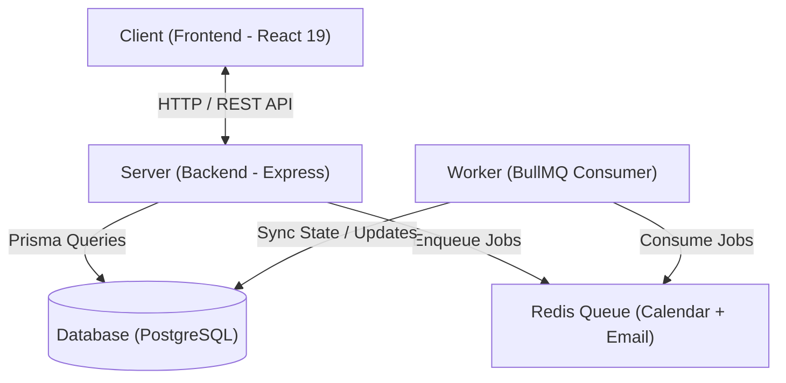

# Cally (Calendly Clone)

A full-stack, enterprise-ready scheduling application built with **Bun**, **React 19**, **Express**, **Prisma ORM**, **BullMQ**, **Redis**, and **PostgreSQL**.

---

## 📌 About The Project

**Cally** is a modern scheduling platform designed to streamline appointment booking, availability management, and calendar synchronization. It enables users to create customizable event types (1-on-1s, group sessions, paid consultations), define recurring weekly availability, and share booking links seamlessly.

### Key Capabilities
- **Smart Availability Management**: Define weekly schedules, date-specific overrides, buffer times, and minimum notice periods.
- **Two-Way Google Calendar Sync**: Automatically checks host availability to prevent double-booking and pushes confirmed events directly to Google Calendar.
- **Asynchronous Background Processing**: High-throughput queue system for instant email notifications, reminder dispatches, and webhook handling.
- **Paid Appointments**: Native Razorpay integration for monetized booking slots with automated payment verification.
- **User Authentication**: Secure authentication & user management powered by Clerk.

---

## 🏗️ System Architecture

The project is structured as a decoupled monorepo comprising a **Client**, an **API Server**, a **Relational Database**, a **Redis Job Queue**, and a background **Worker process**.



### Architecture Breakdown

1. **Client (Frontend)**
   - Built with **React 19**, **Tailwind CSS 4**, and **Framer Motion**, bundled using **Bun**.
   - Handles public booking interfaces, interactive calendar pickers, user onboarding, and host dashboard management.

2. **Server (Backend API)**
   - Built with **Express 5** running on the **Bun Runtime**.
   - Handles REST API endpoints, business logic validation, authentication middleware (Clerk), and database CRUD operations via **Prisma ORM**.
   - Enqueues asynchronous tasks into **Redis** instead of performing blocking I/O during HTTP request cycles.

3. **Database (PostgreSQL)**
   - Central relational storage powering users, event types, availability slots, booking records, payment logs, and OAuth integration tokens.

4. **Redis Queue (Calendar + Email)**
   - Powered by **Redis** and **BullMQ**.
   - Acts as a message broker managing decoupled job queues for:
     - 🗓️ **Calendar Queue**: Async 2-way Google Calendar event creation and availability synchronization.
     - ✉️ **Email Queue**: Instant booking confirmations and automated reminder emails via Resend.
     - 💳 **Payment Queue**: Webhook event processing and payment status verification.

5. **Worker (Background Processor)**
   - Independent service continuously consuming queued tasks from **Redis Queue**.
   - Communicates with external APIs (Google Calendar API, Resend Email API, Razorpay) and directly updates state in the **Database**.

---

## 🔄 End-to-End Booking Data Flow

```
[ Client ] ──────────────► [ Server API ] ──────────────► [ Database ]
 (Book Slot)                (Validate & Create)           (Store Booking)
                                 │
                                 ▼
                     [ Redis Queue (BullMQ) ]
                      (Calendar + Email Jobs)
                                 │
                                 ▼
                             [ Worker ] ──────────────► [ External APIs ]
                       (Process Async Jobs)            (Google Calendar / Resend)
                                 │
                                 ▼
                            [ Database ]
                     (Update Sync Status & Logs)
```

1. **User Request**: Client submits a booking request to the Server API.
2. **Synchronous Handling**: Server validates availability rules, writes the pending/confirmed booking record to the **Database**, and responds to the Client immediately.
3. **Queue Enqueueing**: Server pushes background tasks (e.g., `sync-google-calendar`, `send-confirmation-email`) into the **Redis Queue**.
4. **Asynchronous Execution**: The **Worker** picks up jobs from the queue, invokes Google Calendar / Resend APIs, and writes final status back to the **Database**.

---

## 🛠️ Tech Stack Overview

| Layer | Technologies |
| :--- | :--- |
| **Frontend** | Bun, React 19, React Router v6, Tailwind CSS 4, Framer Motion, Clerk React SDK |
| **Backend API** | Bun Runtime, Express 5, Prisma ORM, Clerk Express SDK, Razorpay Node SDK |
| **Worker Engine** | Bun, BullMQ, Resend Email API, GoogleAPIs Node SDK |
| **Database & Caching** | PostgreSQL (Primary DB), Redis (Queue & Caching) |
| **Containerization** | Docker, Docker Compose |

---

## 📂 Repository Structure

```
calenderly-clone/
├── ai/                # AI system prompts, architecture notes & context
├── backend/           # Express API server & Prisma schema
├── frontend/          # React 19 frontend application
├── worker/            # BullMQ background worker service
├── .env.example       # Central environment variable template
├── docker-compose.yml # Multi-container deployment configuration
└── README.md          # Project documentation
```

---

## 🚀 Getting Started

### Prerequisites

- **Bun**: `curl -fsSL https://bun.sh/install | bash`
- **Docker & Docker Compose**: [Get Docker](https://docs.docker.com/get-docker/)

### Environment Setup

1. Copy `.env.example` to `.env` in the root directory:
   ```bash
   cp .env.example .env
   ```
2. Fill in your credentials (`CLERK_SECRET_KEY`, `RESEND_API_KEY`, `GOOGLE_CLIENT_ID`, `GOOGLE_CLIENT_SECRET`, etc.).

---

### Running with Docker Compose (Recommended)

To launch all services (Frontend, Backend API, Background Worker, PostgreSQL, Redis) simultaneously:

```bash
docker compose up --build
```

Access the services at:
- **Frontend App**: `http://localhost:3000`
- **Backend API**: `http://localhost:5001`
- **PostgreSQL**: `localhost:5432`
- **Redis**: `localhost:6379`

---

### Running Locally (Development Mode)

If running services individually with local database and Redis instances:

```bash
# 1. Install dependencies across all projects
cd frontend && bun install
cd ../backend && bun install
cd ../worker && bun install

# 2. Start Backend API (Port 5001)
cd backend && bun run dev

# 3. Start Background Worker
cd worker && bun run dev

# 4. Start Frontend App (Port 3000)
cd frontend && bun run dev
```

---

## 📖 Documentation & References

- 📄 [Detailed Tech Stack & Architecture Notes](file:///Users/rupeshjagtap/projects/calenderly-clone/ai/tech-stack.md)
- 📄 [System Context & Engineering Guidelines](file:///Users/rupeshjagtap/projects/calenderly-clone/ai/context.md)
